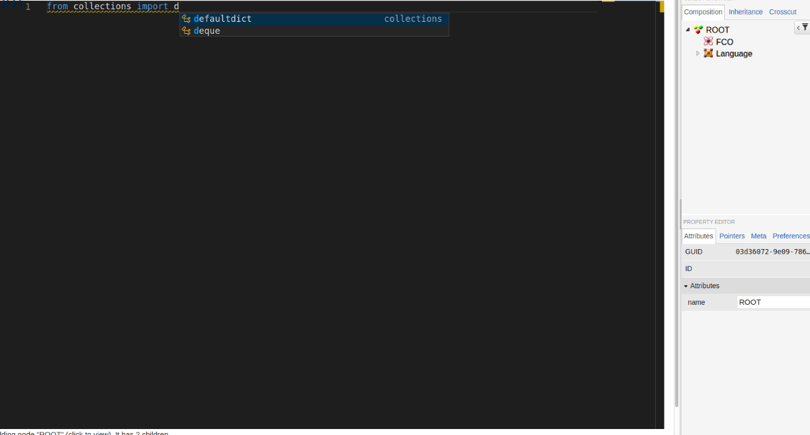

# monaco-webgme-viz
A sample visualizer to connect python-language-server to the monaco editor in webgme.
## Installation
At the root of this repository.
```shell script
npm install
pip install -r requirements.txt
```

## Usage
Start standalone `webgme` server:
```shell script
npm start
```
After you create a project, `MonacoEditor` will be available. Select it as shown in the figure below.

